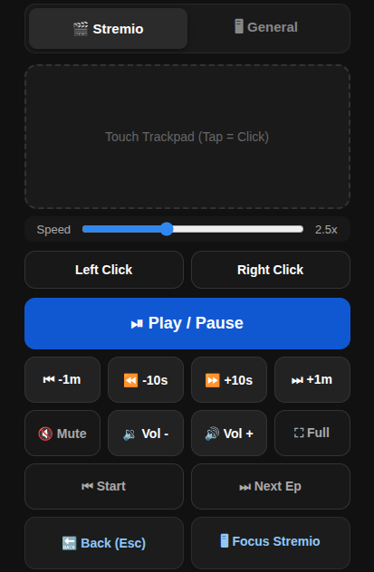
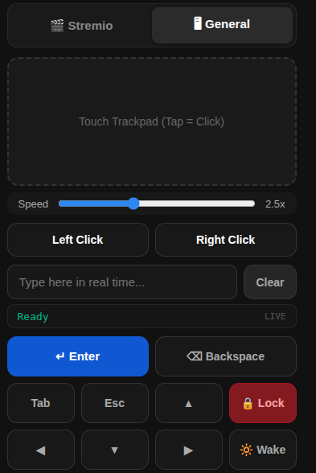

# Stremio Web Remote

A lightweight remote designed to control **Stremio** and maybe your Linux desktop from any mobile browser on your local network

No mobile app etc. installations required — just open the URL on your phone  : `http://<local ip>:8282`

<p align="center">
  
  
</p>

---

## Features

- Touch trackpad & mouse buttons: adjustable sensitivity sliders and tap-to-click
- Stremio-specific controls: Dedicated media controls for playback, 10s/1m seeking, volume, full screen, next episode, restart, and bringing Stremio into focus
- General desktop utility: Navigation arrows, Enter, Backspace, Tab, display wake, and session screen lock
- Environment configurable: Custom host, port, display index (`:0`), and debug flags via `.env`
- Systemd config: Includes background service configuration to automatically start on boot

---

## Prerequisites

- **OS:** Linux running an **X11** desktop session (*Wayland is NOT supported out of the box due to `xdotool` limitation*).
- **Python:** 3.9 or higher
- **xdotool:** Required for simulating input events.

Install `xdotool`:
```bash
# Debian / Ubuntu / Mint
sudo apt update && sudo apt install -y xdotool

# Arch Linux / Manjaro
sudo pacman -S xdotool

# Fedora
sudo dnf install xdotool
```

## quick start

1. clone the repository

```bash
git clone [https://github.com/echosunstar/stremio-web-remote.git](https://github.com/echosunstar/stremio-web-remote.git)
cd stremio-web-remote
```

2. Set Up Python Virtual Environment

```bash
python3 -m venv venv
source venv/bin/activate
pip install -r requirements.txt
```

3. Configure .env

```bash
cp .env.example .env
```

then configure it as you wish

4. Run the server

```bash
python app.py
```

5. that is it

```bash
http://<local ip>:8282 # unless you changed the port obviously
```

6. Run on Boot (systemd Service) (optional)

6.1 Identify your session's XAUTHORITY path and username by running in your desktop terminal:

this will likely be `$HOME/.Xauthority` or `/run/user/<UID>/gdm/Xauthority`

```bash
echo $USER
echo $XAUTHORITY
```

6.2 Create the systemd config file and put this in there

create the file:

```bash
sudo vi /etc/systemd/system/stremio-remote.service
```
put this and exit the editor:

```bash
[Unit]
Description=Stremio Web Remote
After=network.target graphical.target

[Service]
Type=simple
User=YOUR_USER
WorkingDirectory=/home/YOUR_USER/stremio-web-remote
Environment=DISPLAY=:0
Environment=XAUTHORITY=/home/YOUR_USER/.Xauthority
ExecStart=/home/YOUR_USER/stremio-web-remote/venv/bin/python app.py
Restart=always
RestartSec=5

[Install]
WantedBy=graphical.target
```

6.3 Enable and start the service:

```bash
sudo systemctl daemon-reload
sudo systemctl enable --now stremio-remote.service
```

6.4 check the logs that it all works:

```bash
journalctl -u stremio-remote.service -f
```

6.5 also enjoy

```bash
http://<local ip of your machine>:8282
```

7. Project structure

```
stremio-web-remote/
├── app.py                # Flask application & input endpoints
├── templates/
│   └── index.html        # Mobile-first remote UI & touch controls
├── .env.example          # Sample environment variables
├── requirements.txt      # Python dependencies
└── README.md
```

8. security notice

You need to be on a trusted local network as this permits user input  (it is a remote)